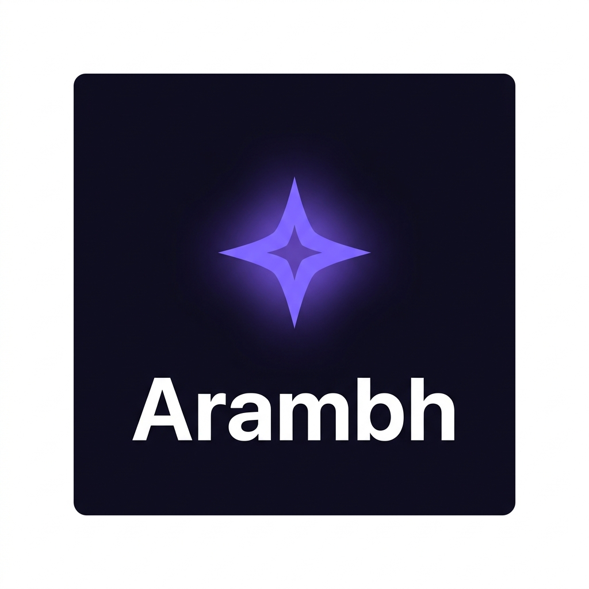

# Arambh — Personal Productivity Dashboard

<div align="center">



**A beautiful, fully offline personal productivity dashboard**
built with pure HTML, CSS & JavaScript — no frameworks, no dependencies.

[](https://github.com/pradeepkumar)
[](LICENSE)
[](https://developer.mozilla.org/en-US/docs/Web/HTML)
[](https://developer.mozilla.org/en-US/docs/Web/CSS)
[](https://developer.mozilla.org/en-US/docs/Web/JavaScript)

</div>

---

## ✨ Overview

**Arambh** (अारम्भ — meaning *"The Beginning"* in Hindi) is a feature-rich, multi-page personal dashboard designed to help you track your **studies**, **finances**, **tasks**, and **projects** — all in one place, without any internet connection or account needed.

> 🔒 All your data stays **100% on your device** via `localStorage`. Nothing is sent to any server.

---

## 🖥️ Live Preview

Simply open `index.html` in any modern browser — no build step, no server required.

```bash
# Clone the repository
git clone https://github.com/pradeepkumar/arambh.git

# Open in browser (macOS)
open index.html

# Open in browser (Windows)
start index.html

# Open in browser (Linux)
xdg-open index.html
```

---

## 📋 Features

### 🏠 Dashboard Home (`index.html`)
| Feature | Description |
|---|---|
| **4 Summary Ring Cards** | Animated SVG rings for Study, Money, Reminders & Projects — click to navigate |
| **Monthly Calendar** | Full calendar with 🔺 red triangle markers on reminder due dates |
| **Quick Links** | Add/edit/delete external links directly from the dashboard |
| **Study Widget** | Today's study hours with subject breakdown |
| **Budget Widget** | Animated donut ring showing monthly spend vs budget |
| **Upcoming Tasks** | Top 5 tasks sorted by due date with overdue highlighting |

### 📚 Study Goal (`study.html`)
| Feature | Description |
|---|---|
| **Session Logger** | Log date, subject, hours, topics & notes |
| **Subject Manager** | Add up to 6 subjects with custom emoji colors |
| **30-Day Heatmap** | Visual grid — 🟩 studied, 🟥 missed, ⬜ no data — filterable by subject |
| **Bar Chart** | Total hours per subject with color-coded bars |
| **Weekly Trend Chart** | Canvas-rendered 7-day bar + line chart |
| **PDF Export** | Generate and print a 30-day study report |

### 💰 Money Goal (`money.html`)
| Feature | Description |
|---|---|
| **Budget Ring** | Large animated donut — 🟢 Green / 🟡 Yellow / 🔴 Red based on spend % |
| **Expense Logger** | Amount, date, category (6 types), optional note |
| **Inline Table Editing** | Edit or delete transactions without leaving the page |
| **Category Chart** | Horizontal bars showing spend distribution by category |
| **Month Filter** | Browse expenses by any past month |
| **Summary Cards** | Total spent, remaining, top category, daily average |

### 🔔 Reminders & Tasks (`reminders.html`)
| Feature | Description |
|---|---|
| **Task Creation** | Title, due date, priority (Low/Medium/High), description |
| **3 View Modes** | Upcoming (by date) / By Priority (grouped) / Completed archive |
| **Priority Coding** | Red/Yellow/Green left border on cards |
| **Overdue Detection** | Automatic red badge for past-due tasks |
| **Calendar Sync** | Due dates auto-appear as 🔺 on Dashboard calendar |
| **Sidebar Badge** | Pending count shown live in navigation |

### 🚀 Project Goal (`projects.html`)
| Feature | Description |
|---|---|
| **Project Cards** | Grid with SVG progress ring per project |
| **Status Cycling** | Click badge to cycle: ⏳ Not Started → 🔄 In Progress → ✅ Completed |
| **Progress Slider** | Live drag-to-update 0–100% progress per project |
| **External Links** | 🌐 Deploy link + 🐙 GitHub repository (open in new tab) |
| **CRUD** | Add, Edit, Duplicate, Delete any project |
| **Filters** | All / In Progress / Completed / Not Started |

### ⚙️ Settings (`settings.html`)
| Feature | Description |
|---|---|
| **Subject Manager** | Add, rename, recolor, delete study subjects |
| **Budget Config** | Set default monthly budget |
| **Quick Links Manager** | Add/remove/edit links shown on the dashboard |
| **Theme Toggle** | Dark 🌙 / Light ☀️ mode with persistence |
| **Accent Color** | 12 preset colors + custom color picker |
| **Data Export** | Download full backup as `.json` |
| **Data Import** | Restore from a `.json` backup file |
| **Clear All Data** | Full reset with confirmation dialog |

---

## 📁 Project Structure

```
arambh/
├── index.html          # Dashboard Home
├── study.html          # Study Goal page
├── money.html          # Money Goal page
├── reminders.html      # Reminders & Tasks page
├── projects.html       # Project Goal page
├── settings.html       # Settings page
├── favicon.png         # App icon (bookmark & tab)
│
├── css/
│   └── main.css        # Global design system, CSS variables, responsive layout
│
└── js/
    ├── store.js        # Unified localStorage data layer (all CRUD helpers)
    ├── components.js   # Sidebar, topbar, ring SVG, toast, modal, utilities
    ├── dashboard.js    # Dashboard home logic
    ├── study.js        # Study goal logic + canvas chart
    ├── money.js        # Money goal logic
    ├── reminders.js    # Reminders logic
    ├── projects.js     # Projects logic
    └── settings.js     # Settings logic
```

---

## 🎨 Design System

The entire UI is built on a token-based CSS system in `css/main.css`:

```css
/* Core accent color (auto-updates entire UI) */
--accent: #7C6FFF;

/* 8px spacing grid */
--space-1: 4px;  --space-2: 8px;  --space-4: 16px;  --space-8: 32px;

/* Dark/Light theme tokens */
--bg-primary  --bg-card  --text-primary  --text-muted  --border
```

### Visual Highlights
- 🌙 **Dark mode** by default with toggle to light mode
- 🎨 **12 accent color presets** + custom color picker
- 💫 **Animated SVG progress rings** throughout the app
- 📊 **Canvas-rendered weekly chart** on the Study page
- ✨ **Smooth page fade-in** (0.25s) on every load
- 📱 **Fully responsive** — hamburger menu + stacked layout on mobile

---

## 💾 Data Architecture

All data is stored in a single `localStorage` key: `arambh_v1`

```json
{
  "settings": {
    "theme": "dark",
    "accentColor": "#7C6FFF",
    "budget": 10000,
    "subjects": [{ "id": "s1", "name": "Mathematics", "color": "#7C6FFF" }],
    "quickLinks": [{ "id": "ql1", "name": "ChatGPT", "url": "https://chatgpt.com", "icon": "🤖" }]
  },
  "study": {
    "sessions": [{ "id": "abc", "date": "2026-06-01", "subjectId": "s1", "hours": 2, "topics": "Algebra", "notes": "" }]
  },
  "money": {
    "budget": 10000,
    "expenses": [{ "id": "xyz", "amount": 250, "date": "2026-06-01", "category": "Food", "note": "Lunch" }]
  },
  "reminders": {
    "tasks": [{ "id": "t1", "title": "Submit Assignment", "dueDate": "2026-06-05", "priority": "high", "completed": false }]
  },
  "projects": {
    "list": [{ "id": "p1", "name": "Portfolio Site", "status": "In Progress", "progress": 65, "deployLink": "", "githubLink": "" }]
  }
}
```

### Backup & Restore
Go to **Settings → Data Management** to:
- **Export** your full data as `arambh-backup-YYYY-MM-DD.json`
- **Import** a previously saved backup file
- **Clear** all data and start fresh

---

## 🚀 Getting Started

### Option 1 — Open Directly
```bash
open index.html   # macOS
start index.html  # Windows
```

### Option 2 — Local Server (recommended to avoid CORS issues)
```bash
# Python 3
python3 -m http.server 3000
# Then open: http://localhost:3000

# Node.js (npx)
npx serve .
# Then open: http://localhost:3000
```

### Option 3 — VS Code Live Server
1. Install the **Live Server** extension in VS Code
2. Right-click `index.html` → **Open with Live Server**

---

## 🌐 Browser Support

| Browser | Support |
|---|---|
| Chrome 90+ | ✅ Full support |
| Firefox 88+ | ✅ Full support |
| Safari 14+ | ✅ Full support |
| Edge 90+ | ✅ Full support |
| Opera | ✅ Full support |

> **Note:** Requires JavaScript enabled and localStorage access (not available in private/incognito mode on some browsers).

---

## 📱 Progressive Web App (Coming Soon)

Future plans to add:
- `manifest.json` for "Add to Home Screen" support
- Service Worker for full offline caching
- Push notification reminders

---

## 🤝 Contributing

Contributions are welcome! Here's how:

```bash
# Fork the repo, then:
git clone https://github.com/your-username/arambh.git
cd arambh

# Create a feature branch
git checkout -b feature/my-new-feature

# Make your changes, then commit
git add .
git commit -m "feat: add my new feature"

# Push and open a Pull Request
git push origin feature/my-new-feature
```

### Contribution Ideas
- [ ] PWA support (manifest + service worker)
- [ ] Pomodoro timer integration on Study page
- [ ] Recurring tasks support in Reminders
- [ ] CSV export for expense data
- [ ] Chart.js integration for richer analytics
- [ ] Multi-device sync via a free backend (e.g., Supabase)

---

## 📄 License

```
MIT License

Copyright (c) 2026 Pradeep Kumar

Permission is hereby granted, free of charge, to any person obtaining a copy
of this software and associated documentation files (the "Software"), to deal
in the Software without restriction, including without limitation the rights
to use, copy, modify, merge, publish, distribute, sublicense, and/or sell
copies of the Software, and to permit persons to whom the Software is
furnished to do so, subject to the following conditions:

The above copyright notice and this permission notice shall be included in all
copies or substantial portions of the Software.

THE SOFTWARE IS PROVIDED "AS IS", WITHOUT WARRANTY OF ANY KIND.
```

---

## 👨‍💻 Author

<div align="center">

**Made with ❤️ by Pradeep Kumar**

*"Arambh — Because every great journey needs a great beginning."*

</div>
